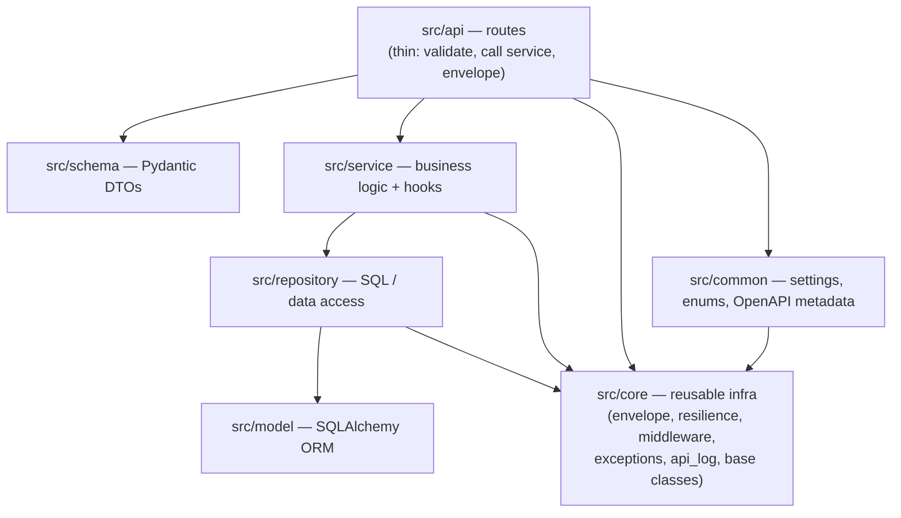
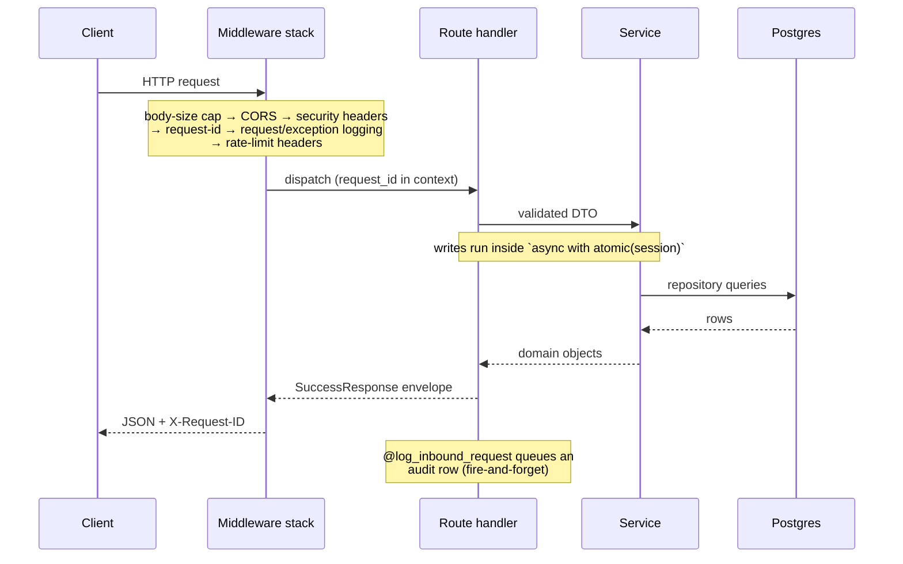
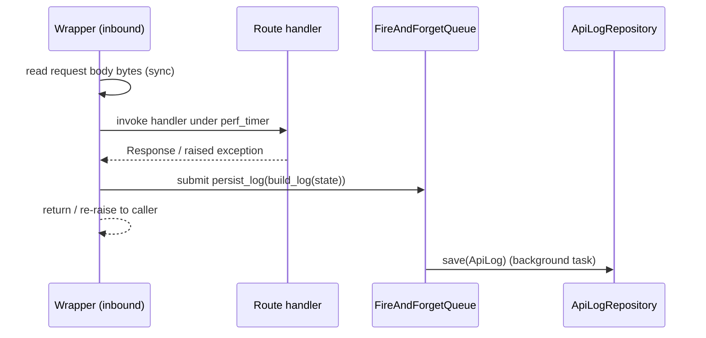

# Architecture

> Thin starter doc — update it as your service's structure solidifies.

## Layers

The codebase is a conventional layered FastAPI service. Dependencies point
**downward only**; `src.core` never imports `src.common` or any domain
package, which keeps it liftable into the next project unchanged.



## Request lifecycle



A raised `BaseCustomError` subclass is caught by the central handler
(`core/exceptions/handlers.py`), mapped to an HTTP status via the registry,
and serialised into the same `ErrorEnvelope` shape.

## API audit log

`src.core.api_log` records one row per inbound request and per outbound
HTTP call. The capture pipeline is split into focused modules so the
hot path stays tight and the helpers stay unit-testable in isolation:

| Module | Responsibility |
|---|---|
| `inbound.py` | `@log_inbound_request` route decorator |
| `outbound.py` | `@log_outbound_request` service-method decorator |
| `dispatch.py` | `FireAndForgetQueue` + `persist_log` + the shared `capture_and_dispatch` skeleton |
| `sanitizers.py` | Pure helpers: header redaction, body truncation, JSONB-safe casts |
| `error_messages.py` | `build_error_message` (composes the audit `error_message` string) |
| `decorators.py` | Re-export shim for the historical import path |

`capture_and_dispatch` owns the shared wrapper shape (start `perf_timer`
→ `await func` → on success or failure schedule `persist_log` via the
bounded `FireAndForgetQueue`). Per-direction setup — reading the request
body synchronously for inbound, swapping the `outbound_response_meta_ctx`
ContextVar for outbound — lives in each decorator module's `wrapper`.



The fire-and-forget contract means a DB outage or a degraded backend
can never fail the calling request — submissions overflow the queue
with a single warning, and `persist_log` swallows repository errors
after logging them.

`ApiLog.duration_ms` is a `float` with sub-millisecond precision; fast
handlers (cache-hit reads, 304 paths, in-memory fallbacks) routinely
land in the 0.1–1 ms range, and dashboards or alerts that consume the
column should not truncate to int. See
[ADR-0001](decisions/0001-fire-and-forget-audit-pipeline.md) for the
fire-and-forget design rationale.

## Resilience layer

**Owned by `resilience-kit==0.1.0`** — circuit breaker, retry, cache,
throttle/rate-limit, the recovery monitor, the async-singleton
providers, and the in-memory fallback all live in the kit, not in
this repo. See
[ADR-0003](decisions/0003-outsource-resilience-to-resilience-kit.md).

The boilerplate adds two thin bridges on top of the kit
(`src/core/middleware/request_id_bridge.py` for request-id
propagation; `src/app.py::kit_error_handler` for envelope
translation — kit handlers are deliberately not installed, see
[ADR-0002](decisions/0002-exception-http-registry.md)) and wires the
kit's recovery monitor and health-snapshot into the FastAPI lifespan
and `/readyz`. Concrete operator-facing details — backend selection,
fallback semantics, scope and global-throttle behaviour, recovery
triggers — live in [`docs/resilience.md`](resilience.md).

`src.core` re-exports the kit's public surface so call sites stay
short:

```python
from src.core import circuit_breaker, resilient, retry_on_failure
from src.core import rate_limit, FernetCipher, assert_public_url
```

`rate_limit` is also importable from `resilience_kit.adapters.fastapi`
— every real call site under `src/api/v1/` uses that one.

## Background tasks (Celery)

`src.core.tasks` wires Celery as the durable / retried / scheduled
background task framework. The broker is the Redis URL named by
`CoreSettings.task_redis_alias`; result storage defaults to the same
URL and can be overridden via `CELERY_RESULT_BACKEND`. The worker
binary is `python -m src.management.run_worker worker` (a thin wrapper
that binds settings and configures logging before handing off to the
Celery CLI). Domain task modules live under `src.tasks.*` and are
autodiscovered at worker startup.

Two decorators are provided:

* `@register_task` — for sync tasks; thin wrapper over
  `celery_app.task`.
* `@async_task` — for tasks that need async repositories / cache /
  HTTP client. Each invocation runs the coroutine in a fresh
  `asyncio.run(...)` loop on the Celery worker thread, so the body
  composes with the existing async layer without leaking a loop
  across invocations.

Producer side: `enqueue("task.name", *args, **kwargs)` is the one-line
helper around `celery_app.send_task` that defaults the queue to
`CoreSettings.task_queue_name`.

`fire_and_forget` (`src.core.utils.fire_and_forget`) stays as the
right tool for best-effort fan-out (audit, telemetry) where a dropped
task on overflow is acceptable. Celery is the right tool when work
must survive a worker crash.

## Startup / shutdown

`src/app.py`'s lifespan: bind settings into `core.runtime` → wait briefly
for Redis → build the shared DB engine → start the api_log backend. Shutdown
reverses it, drains fire-and-forget log tasks (bounded by
`api_log_drain_timeout_seconds`, default 30s, so a degraded audit backend
cannot hang shutdown), and disposes pools. Adding a resource never
requires touching this file.

## Scaling

The boilerplate is designed for horizontal scaling out of the box.
Operate it with these assumptions:

- **Stateless app processes.** No in-process session state. Run any
  number of workers (uvicorn `--workers N` or N pods) behind a load
  balancer; requests can land on any process.
- **Redis as shared state.** Circuit-breaker state, rate-limit
  buckets, and cache entries are stored in Redis so the limits hold
  across the fleet. The in-memory fallback (used when Redis is
  unreachable) is per-process — fleet-wide consistency degrades to
  per-worker until Redis recovers.
- **Postgres pool sizing.** Each worker owns one engine /
  `AsyncEngine` instance; the pool size + worker count must not
  exceed Postgres `max_connections - reserved_connections`. Rule of
  thumb: `pool_size + max_overflow` ≈ `max_connections / workers`,
  leave 10 connections headroom for admin sessions.
- **Audit-log back-pressure.** The bounded `FireAndForgetQueue`
  (`max_pending=2000` per queue) drops new submissions with a single
  warning per overflow event when saturated. Monitor the warning
  rate, not the audit-row count — under back-pressure rows are lost
  silently from the consumer's perspective. Raise `max_pending` if
  the audit backend can absorb more, or shed load on the producer
  side first.
- **High availability.** Redis should sit behind Sentinel or run as a
  cluster so the single-node fallback only kicks in during real
  failures. Postgres should have a synchronous replica + failover
  configured; the app reconnects automatically when the engine pool
  invalidates.

`scripts/profile_audit_path.py` records the per-call overhead of
`capture_and_dispatch` against a no-op repository — re-run it after
touching anything under `src/core/api_log/` to catch regressions. The
2026-05-29 baseline is `p99 = 5.9 µs`; the script fails with exit 1
when p99 exceeds the configurable bound (default 5 ms).
