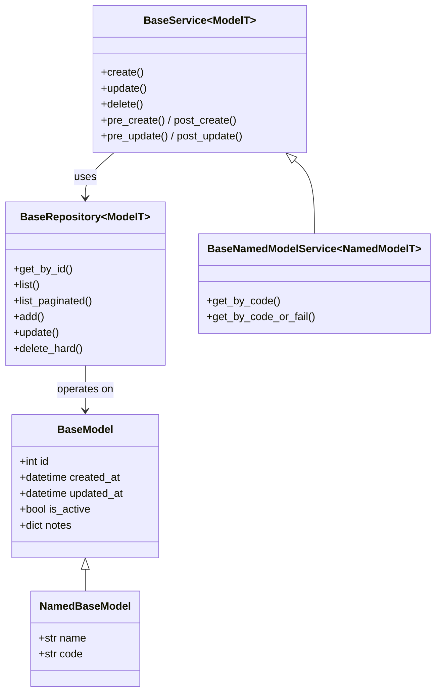
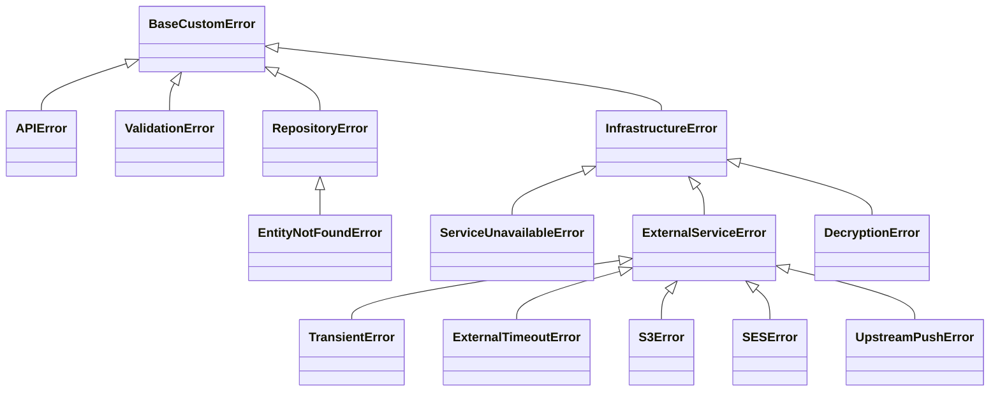

# Class diagrams

> Thin starter doc — extend it as you add base classes or exception families.

## Data-layer base classes



A concrete resource wires these together: `Item(NamedBaseModel)`,
`ItemRepository(BaseRepository[Item])`,
`ItemService(BaseNamedModelService[Item])`.

## Exception hierarchy

Every custom error derives from `BaseCustomError` and is mapped to an HTTP
status in `core/exceptions/handlers.py` via `register_exception_mapping`
(specific subclass registered before its parent).



### Adding your own family

```python
from src.core.base.exception import BaseCustomError
from src.core.exceptions import register_exception_mapping
from fastapi import status

class PaymentDeclinedError(BaseCustomError):
    default_message = "Payment was declined."
    error_code = "PAYMENT_DECLINED"
    status_code = 402

# register once at startup (specific subclasses before their parent)
register_exception_mapping(PaymentDeclinedError, status.HTTP_402_PAYMENT_REQUIRED)
```

(`UpstreamPushError` ships as a generic "push to an upstream API failed"
example — rename or remove it for your domain.)
