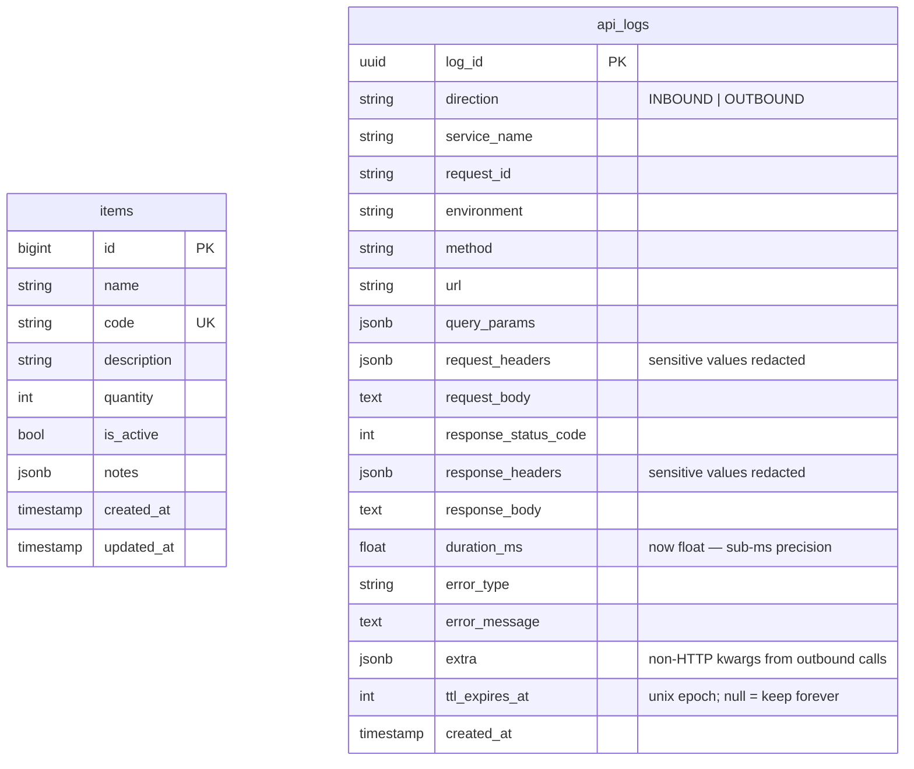

# Entity-Relationship Diagram

> Thin starter doc. The boilerplate ships only the example `items` table and
> the infrastructure `api_logs` table. **Replace this with your real schema**
> and keep it in sync with each Alembic migration.



## `api_logs` — indexes and query patterns

```
PRIMARY KEY              (log_id)
INDEX ix_api_logs_request_id   (request_id)   -- trace a request end-to-end
INDEX ix_api_logs_created_at   (created_at)   -- pruning + time-range queries
INDEX ix_api_logs_service_name (service_name) -- per-integration dashboards
INDEX ix_api_logs_ttl_expires_at (ttl_expires_at) WHERE ttl_expires_at IS NOT NULL
```

The `request_headers` / `query_params` / `response_headers` / `extra`
JSONB columns are queried positionally (`->'<key>'`) or with `@>` for
containment; no GIN index ships by default — add one if a specific key
becomes a hot filter. `request_body` / `response_body` are `text` (not
JSONB) because they need to round-trip non-JSON wire formats verbatim.

## Evolving the schema

## Conventions (from `BaseModel`)

Every domain table inherits from `BaseModel` (or `NamedBaseModel`) and gets:

- `id` — `bigint` autoincrement primary key.
- `created_at` / `updated_at` — timezone-aware, server-defaulted.
- `is_active` — indexed soft-delete flag (the service layer flips this
  instead of hard-deleting, and cascades to children).
- `notes` — free-form `jsonb` slot.
- `NamedBaseModel` adds `name` and a unique business `code`.

`api_logs` is owned by `src.core.api_log` and has its **own** metadata
(separate from `BaseModel.metadata`) — both are combined in
`alembic/env.py`'s `target_metadata`.

## Workflow

After any column/constraint change:

```bash
alembic revision --autogenerate -m "describe the change"
# review the generated migration — autogenerate misses CHECK constraints,
# partial indexes, and column comments; add them by hand if needed.
alembic upgrade head
```

Then update this diagram and the relevant section in
[`docs/architecture.md`](architecture.md) in the same commit. The
repo-wide rule (root `CLAUDE.md`) treats a code change that lands
without its matching doc change as incomplete.
