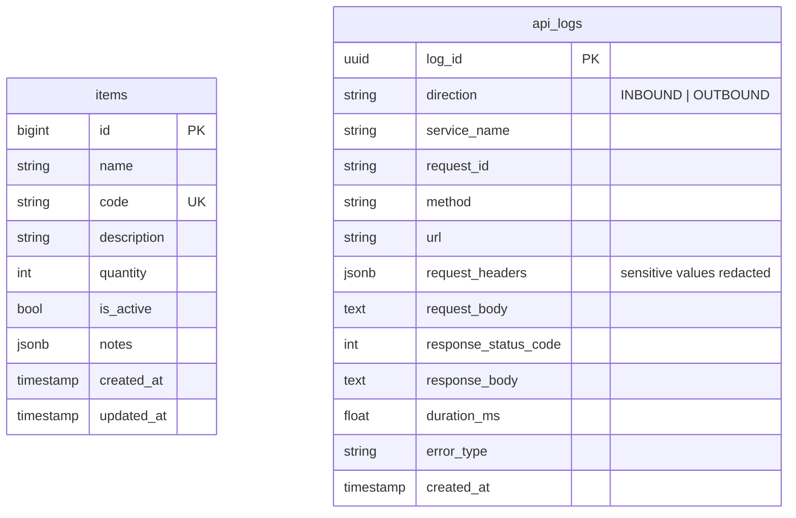

# Entity-Relationship Diagram

> Thin starter doc. The boilerplate ships only the example `items` table and
> the infrastructure `api_logs` table. **Replace this with your real schema**
> and keep it in sync with each Alembic migration.



## Conventions (from `BaseModel`)

Every domain table inherits from `BaseModel` (or `NamedBaseModel`) and gets:

- `id` — `bigint` autoincrement primary key.
- `created_at` / `updated_at` — timezone-aware, server-defaulted.
- `is_active` — indexed soft-delete flag (the service layer flips this
  instead of hard-deleting, and cascades to children).
- `notes` — free-form `jsonb` slot.
- `NamedBaseModel` adds `name` and a unique business `code`.

`api_logs` is owned by `src.core.api_log` and has its **own** metadata
(separate from `BaseModel.metadata`) — both are combined in
`alembic/env.py`'s `target_metadata`.

## Workflow

After any column/constraint change:

```bash
alembic revision --autogenerate -m "describe the change"
# review the generated migration
alembic upgrade head
```

Then update this diagram in the same commit.
